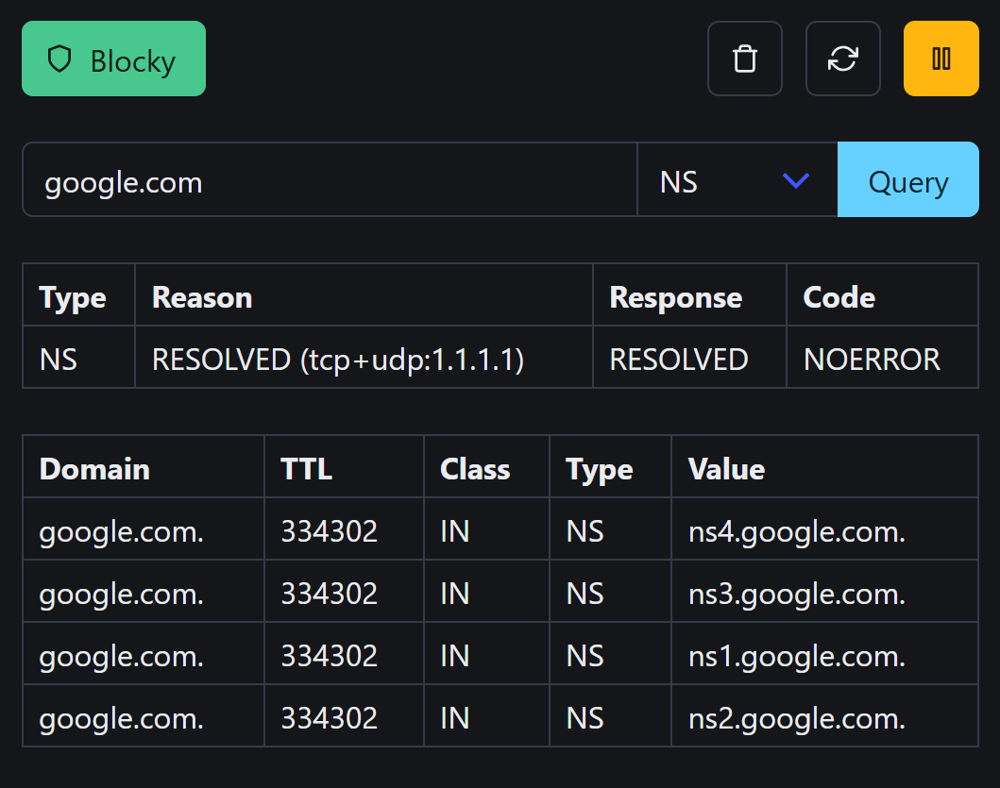

# blocky-ui

Simple web interface for [blocky](https://github.com/0xERR0R/blocky), a lightweight DNS proxy and DNS ad-blocker.

## Features

- web interface for all blocky API functions:
    - toggle or pause blocking
    - execute DNS queries
    - refresh allow and deny lists
    - flush DNS cache
- uses [HTMX](https://htmx.org/) to get status and query updates
- **no lost functionality if Javascript is disabled:**
    - uses `<form>` for full page reloads
    - pause end time instead of countdown

### Screenshot



## Config

All config is done via environment variables:

| Name             | Info                                                                   | Default                  |
|------------------|------------------------------------------------------------------------|--------------------------|
| `HOST`           | HTTP host                                                              | `0.0.0.0`                |
| `PORT`           | HTTP port                                                              | `3000`                   |
| `API_BASE_URL`   | blocky API URL, no trailing slash                                      | `http://blocky:4000/api` |
| `PAUSE_DURATION` | [Duration](https://pkg.go.dev/time#ParseDuration) for the pause button | `5m`                     |

## Run with docker

Use `-e API_BASE_URL=...` or `--env-file .env` to set the variables if needed.

```shell
docker run --name blocky-ui -p 3000:3000 ghcr.io/ivvija/blocky-ui
```

Build it yourself:

```shell
docker buildx build --build-arg VERSION=latest . -t blocky-ui
```


### compose.yml

```yaml
services:
  blocky:
    image: spx01/blocky  # alt: ghcr.io/0xerr0r/blocky
    container_name: blocky
    # ... other blocky config
    # https://0xerr0r.github.io/blocky/latest/installation/#run-with-docker-compose

  blocky-ui:
    image: ghcr.io/ivvija/blocky-ui
    container_name: blocky-ui
    restart: unless-stopped
    depends_on:
      - blocky
    environment:
      API_BASE_URL: http://blocky:4000/api
    ports:
      - "3000:3000/tcp"
```

## Run locally for tinkering

This project is set up for [live-reloading with air](https://github.com/air-verse/air), so just run `air` and
open `http://127.0.0.1:8080/`

## Notes

This is my first Go project, so issues and other comments are welcome!
